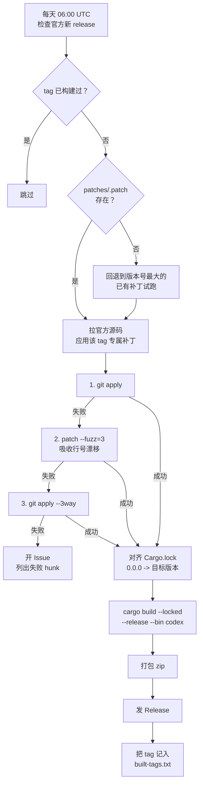

# codex-patched-build

自动把对应 tag 的补丁（`patches/<tag>.patch`）应用到官方 codex 源码上，编译出打了补丁的
**Windows x64 版 `codex.exe`**，发到本仓库的 Release。

**本仓库不包含任何 codex 源代码。** 源码在 CI 里临时拉取。

## 用法

1. 打开 [Releases](../../releases)，下载最新的 `codex-<tag>-windows-x64.zip`
2. 解压，把 `codex.exe` 覆盖到 npm 包的 vendor 目录：

```
<nodejs>\node_modules\@openai\codex\node_modules\@openai\codex-win32-x64\
  vendor\x86_64-pc-windows-msvc\bin\codex.exe
```

例如本机路径是：

```
D:\Workspace\nvm\nodejs\node_modules\@openai\codex\node_modules\
  @openai\codex-win32-x64\vendor\x86_64-pc-windows-msvc\bin\codex.exe
```

3. 验证：

```bash
codex --version
```

覆盖前建议备份原文件（原文件约 323 MB）。

### ⚠️ 版本必须和 npm 包一致

`codex.exe` 运行时会调用同目录下的辅助程序：

```
codex-resources\codex-command-runner.exe
codex-resources\codex-windows-sandbox-setup.exe
codex-path\rg.exe
```

这些**不由本仓库编译**，用的是 npm 包自带的原版。所以替换的 `codex.exe`
必须和 npm 包**同属一个官方版本**：

| 情况 | 做法 |
|---|---|
| npm 包是 0.156.1，替换 0.156.1 的补丁版 | ✅ 直接替换 |
| npm 包是 0.156.1，想换 0.157.1 的补丁版 | ⚠️ 先把 npm 包升到 0.157.1 |

```bash
npm install -g @openai/codex@0.157.1   # 先升级
# 再替换 codex.exe
```

zip 里的 `BUILD-INFO.txt` 记录了 `upstream_tag`，可用来核对版本。

## 工作流程



## 补丁文件

补丁**按 tag 分文件存放**，一个官方版本对应一份。**都不含 `Cargo.lock`**
（版本号由 workflow 对齐，见下）：

| 补丁文件 | 对应官方 tag | 规模 |
|---|---|---|
| `patches/rust-v0.156.1.patch` | `rust-v0.156.1` | 41 文件 / 156 hunk |
| `patches/rust-v0.157.1.patch` | `rust-v0.157.1` | 41 文件 / 156 hunk |
| `patches/rust-v0.158.0.patch` | `rust-v0.158.0` | 41 文件 / 156 hunk |
| `patches/rust-v0.159.0.patch` | `rust-v0.159.0` | 41 文件 / 156 hunk |
| `patches/rust-v0.159.1.patch` | `rust-v0.159.1` | 41 文件 / 156 hunk |
| `patches/rust-v0.159.2.patch` | `rust-v0.159.2` | 41 文件 / 156 hunk |
| `patches/rust-v0.159.3.patch` | `rust-v0.159.3` | 41 文件 / 156 hunk |
| `patches/rust-v0.160.0.patch` | `rust-v0.160.0` | 41 文件 / 156 hunk |

每份补丁都按自己的目标 tag 重新锚定：在对应的干净浅克隆上
`git apply --check` 直接返回 0，不需要 `--3way`、也不需要基线 tag 的对象。
交叉误用会被拒绝（例如 158 的补丁打到 156/157/160 都是 `check exit=1`）。
落地后 `codex-rs/Cargo.lock` 与官方完全一致（只有版本行不同）。

workflow 按待构建的 tag 自动选中 `patches/<tag>.patch`。官方刚发新版、专属
补丁还没写出来时，会回退到版本号最大的那份补丁先试跑（成功则照常构建，
失败才开冲突 Issue）。

**补丁不含 `Cargo.lock`。** 官方 tag 自带的 `Cargo.lock` 里，workspace 成员
版本是 `0.0.0`，而 `Cargo.toml` 写的是版本号（如 `0.160.0`）；编译用
`cargo build --locked`，两者必须一致。`prepare` 阶段会把 lock 里所有
`version = "0.0.0"` 改写成目标 tag 的版本号。

> 这一步以前是补丁在做，占掉 303 个 hunk 里的 147 个（近一半），而且每次换
> tag 版本号就变、必然冲突。现在交给 workflow：写法上先校验「lock 里的
> `0.0.0` 行数 == `version.workspace = true` 的包数」再改，相等才动 —— 保证
> 改的只是 workspace 成员，不会误伤第三方依赖；不等就报错退出，不猜。

已构建的 tag 见 `built-tags.txt`。注意它只控制"是否跳过"：某 tag 已记录后，
想重建必须显式勾选 `force`。这个文件只在 workflow 里追加，
手动 dispatch 时若目标 tag 已在其中，会被判定为 `skip` 而什么都不做。

### 补丁应用的兜底顺序

`prepare` 阶段按下面的顺序尝试，前一档能过就不走后面：

| 顺序 | 手段 | 能自动处理的情况 |
|---|---|---|
| 1 | `git apply` | 上下文完全一致 |
| 2 | `patch -p1 --fuzz=3` | **上游在锚点附近插了几行**，上下文整体偏移但语义没变 |
| 3 | `git apply --3way` | 需要 pre-image blob；浅克隆得先 `fetch --unshallow` |

第 2 档是关键：实测把 157.1 的补丁直接打到 158.0~160.0 上，300 个 hunk 里
靠 fuzz 能自动吸收到只剩 3~5 个真失败。它先 `--dry-run` 统计失败 hunk，
**只有全部 hunk 都能落地才真正应用**，避免出现"大部分应用、少数 hunk 被
静默跳过"的半成品源码。

走到第 3 档仍失败，才是真正的语义冲突，此时开的 Issue 会列出具体失败的
hunk（不是笼统的"上下文被破坏"）。

### 新增一个 tag 的补丁

官方发了新 tag、CI 开了冲突 Issue 时：

```bash
git clone --depth 1 -b <新tag> https://github.com/openai/codex.git
cd codex
patch -p1 --fuzz=3 --dry-run --forward < /path/to/patches/<上一个tag>.patch  # 看哪些 hunk 真失败
git apply --3way /path/to/patches/<上一个tag>.patch                          # 看冲突块
# 按新代码结构重写补丁，另存为 patches/<新tag>.patch
```

要点：**不要把 `Cargo.lock` 写进补丁**（版本号由 workflow 对齐）。
改完确认 `built-tags.txt` 里没有该 tag（否则会被跳过），需要时用 `force` 重建。

### 已知的冲突落点（156→160 一直漂移的四处）

上游改这些位置时，补丁的锚点会失配。都是「上游新增」与「补丁新增」并存，
保留两边即可，不需要重新实现功能：

| 文件 | 冲突形态 | 合并方式 |
|---|---|---|
| `protocol/src/error.rs` | 补丁把 `ServerOverloaded` / `RetryLimit` 从不可重试臂移到可重试臂 | 移臂，同时保留上游新增的 `FlexUnavailable` / `ContentFilter` |
| `protocol/src/error.rs` | `retry_delay` 改用固定 10 秒 | 保留补丁语义，但注意上游把 `server_retry_delay` 从字段改成了方法（`self.server_retry_delay()`） |
| `tui/src/chatwidget.rs` + `constructor.rs` | 补丁新增 `pending_output_free_interrupt_turn_id` | 与上游新增的 `test_codex_home` 并存，字段声明与 `None` 初始化两处都要留 |
| `tui/src/resume_picker.rs` | 补丁让 resume 忽略 provider 过滤 | 上游把函数改成 `async` 且换用 `app_server`，需按新签名重写函数体后返回 `ProviderFilter::Any`（仅 160.0 出现） |

> ⚠️ 解 `resume_picker.rs` 时注意：`picker_provider_filter` 的结尾 `}` 在冲突标记
> **之外**（属于公共上下文）。替换整段函数体时**不要**再写一个 `}`，否则会多出
> 右花括号 → `unexpected closing delimiter`。

### 已知的两个编译级陷阱（apply 成功也编不过）

下面两处 `git apply` 完全成功，**只有编译才会暴露**。重做补丁后务必跑一次编译
（`cargo check --locked -p codex-tui`）再推。

| 位置 | 症状 | 处理 |
|---|---|---|
| `model-provider-info/src/lib.rs` | `error[E0433]: cannot find module or crate 'codex_api'` | 上游 `f5960fcc2`（Reduce dependency coupling）起，`codex-model-provider-info` 不再依赖 `codex-api`。补丁新增的 `supports_remote_compaction()` 调用 `codex_api::is_azure_responses_provider` 会失败。该判定是纯字符串匹配，**内联**进来即可；不要把依赖加回去（那还会改 `Cargo.lock` 的依赖列表，与 `--locked` 冲突） |
| `tui/src/resume_picker.rs` | `error: unexpected closing delimiter: '}'` | 见上一条注释：解冲突时多写了一个 `}` |

## 补丁内容

| # | 改动 |
|---|---|
| 1 | 模型请求进度用数据包体积代替 token 估算 |
| 2 | 压缩横幅区分「本地压缩 / 远程压缩」 |
| 3 | 重试上限 1000 次 |
| 4 | 重试固定 10 秒，去掉指数退避 |
| 5 | `ServerOverloaded` 等改为可重试 |
| 6 | cyber 警告只弹 Warning，不强制中断会话 |
| 7 | `resume` 忽略 provider 过滤，只按文件夹过滤 |
| 8 | GPT-5.6 上下文改回 353k |
| 9 | 模型无输出时按 Esc 快速改提示词 |
| 10 | 日志等级改 INFO |

> 未包含原始 `codex.patch` 里的「砍掉 desktop / mcp server 支持」那组改动 ——
> 那部分针对的代码结构在 0.156 已重构，需要单独处理。

## 手动触发

Actions → `build-windows-codex` → Run workflow，可指定：

- `tag`：构建哪个官方 tag（留空 = 最新正式版）
- `force`：忽略已构建记录，强制重建

## 为什么只编 `codex`

`codex` CLI 不依赖 `codex-code-mode`，因此不触发 V8 产物下载。官方 release
workflow 还会编 `codex-code-mode-host` / `codex-app-server` / `bwrap`，那些
需要自建 runner 和 `openai/codex` 的预编译 V8，fork 里跑不了，本仓库也不需要。
