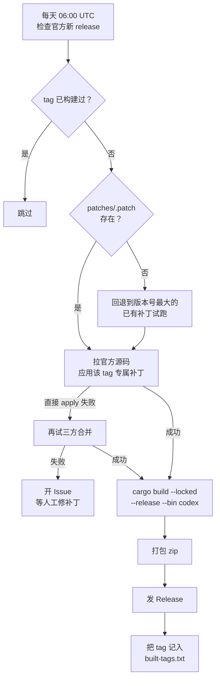

# codex-patched-build

自动把对应 tag 的补丁（`patches/<tag>.patch`）应用到官方 codex 源码上，编译出打了补丁的
**Windows x64 版 `codex.exe`**，发到本仓库的 Release。

**本仓库不包含任何 codex 源代码。** 源码在 CI 里临时拉取。

## 用法

1. 打开 [Releases](../../releases)，下载最新的 `codex-<tag>-windows-x64.zip`
2. 解压，把 `codex.exe` 覆盖到 npm 包的 vendor 目录：

```
<nodejs>\node_modules\@openai\codex\node_modules\@openai\codex-win32-x64\
  vendor\x86_64-pc-windows-msvc\bin\codex.exe
```

例如本机路径是：

```
D:\Workspace\nvm\nodejs\node_modules\@openai\codex\node_modules\
  @openai\codex-win32-x64\vendor\x86_64-pc-windows-msvc\bin\codex.exe
```

3. 验证：

```bash
codex --version
```

覆盖前建议备份原文件（原文件约 323 MB）。

### ⚠️ 版本必须和 npm 包一致

`codex.exe` 运行时会调用同目录下的辅助程序：

```
codex-resources\codex-command-runner.exe
codex-resources\codex-windows-sandbox-setup.exe
codex-path\rg.exe
```

这些**不由本仓库编译**，用的是 npm 包自带的原版。所以替换的 `codex.exe`
必须和 npm 包**同属一个官方版本**：

| 情况 | 做法 |
|---|---|
| npm 包是 0.156.1，替换 0.156.1 的补丁版 | ✅ 直接替换 |
| npm 包是 0.156.1，想换 0.157.1 的补丁版 | ⚠️ 先把 npm 包升到 0.157.1 |

```bash
npm install -g @openai/codex@0.157.1   # 先升级
# 再替换 codex.exe
```

zip 里的 `BUILD-INFO.txt` 记录了 `upstream_tag`，可用来核对版本。

## 工作流程



## 补丁文件

补丁**按 tag 分文件存放**，一个官方版本对应一份：

| 补丁文件 | 对应官方 tag | 规模 |
|---|---|---|
| `patches/rust-v0.156.1.patch` | `rust-v0.156.1` | 42 文件 / 303 hunk |
| `patches/rust-v0.157.1.patch` | `rust-v0.157.1` | 42 文件 / 303 hunk |
| `patches/rust-v0.158.0.patch` | `rust-v0.158.0` | 42 文件 / 306 hunk |
| `patches/rust-v0.159.0.patch` | `rust-v0.159.0` | 42 文件 / 306 hunk |
| `patches/rust-v0.159.1.patch` | `rust-v0.159.1` | 42 文件 / 306 hunk |
| `patches/rust-v0.159.2.patch` | `rust-v0.159.2` | 42 文件 / 307 hunk |
| `patches/rust-v0.159.3.patch` | `rust-v0.159.3` | 42 文件 / 307 hunk |
| `patches/rust-v0.160.0.patch` | `rust-v0.160.0` | 42 文件 / 307 hunk |

每份补丁都按自己的目标 tag 重新锚定，**不依赖 `--3way`**：在对应的浅克隆上
`git apply --check` 直接返回 0，也不需要基线 tag 的对象。交叉误用会被拒绝
（例如 158 的补丁打到 156/157/160 都是 `check exit=1`）。

workflow 按待构建的 tag 自动选中 `patches/<tag>.patch`。官方刚发新版、专属
补丁还没写出来时，会回退到版本号最大的那份补丁先试跑（成功则照常构建，
失败才开冲突 Issue）。回退补丁里 `Cargo.lock` 写的是它自己基线的版本号，
`prepare` 阶段会按目标 tag 的 `[workspace.package] version` 改写对齐。

已构建的 tag 见 `built-tags.txt`。注意它只控制"是否跳过"：某 tag 已记录后，
想重建必须显式勾选 `force`。注意这个文件只在 workflow 里追加，
手动 dispatch 时若目标 tag 已在其中，会被判定为 `skip` 而什么都不做。

### 新增一个 tag 的补丁

官方发了新 tag、CI 开了冲突 Issue 时：

```bash
git clone --depth 1 -b <新tag> https://github.com/openai/codex.git
cd codex
git apply --3way /path/to/patches/<上一个tag>.patch   # 看冲突
# 按新代码结构重写补丁，另存为 patches/<新tag>.patch
```

要点：`Cargo.lock` 里的 workspace 成员版本必须改成**目标 tag 的**
`[workspace.package] version`（例如 158.0 就要写 `0.158.0`）。判据是
`codex-rs/**/Cargo.toml` 里所有 `version.workspace = true` 的包名，
在 `Cargo.lock` 里对应的 `version` 行必须逐一相等；只按旧版本号字符串
替换会漏掉上游新增的成员包，`cargo build --locked` 会直接失败。
改完确认 `built-tags.txt` 里没有该 tag（否则会被跳过），需要时用 `force` 重建。

### 已知的冲突落点（156→160 一直漂移的四处）

上游改这些位置时，补丁的锚点会失配。都是「上游新增」与「补丁新增」并存，
保留两边即可，不需要重新实现功能：

| 文件 | 冲突形态 | 合并方式 |
|---|---|---|
| `protocol/src/error.rs` | 补丁把 `ServerOverloaded` / `RetryLimit` 从不可重试臂移到可重试臂 | 移臂，同时保留上游新增的 `FlexUnavailable` / `ContentFilter` |
| `protocol/src/error.rs` | `retry_delay` 改用固定 10 秒 | 保留补丁语义，但注意上游把 `server_retry_delay` 从字段改成了方法（`self.server_retry_delay()`） |
| `tui/src/chatwidget.rs` + `constructor.rs` | 补丁新增 `pending_output_free_interrupt_turn_id` | 与上游新增的 `test_codex_home` 并存，字段声明与 `None` 初始化两处都要留 |
| `tui/src/resume_picker.rs` | 补丁让 resume 忽略 provider 过滤 | 上游把函数改成 `async` 且换用 `app_server`，需按新签名重写函数体后返回 `ProviderFilter::Any`（仅 160.0 出现） |

## 补丁内容

| # | 改动 |
|---|---|
| 1 | 模型请求进度用数据包体积代替 token 估算 |
| 2 | 压缩横幅区分「本地压缩 / 远程压缩」 |
| 3 | 重试上限 1000 次 |
| 4 | 重试固定 10 秒，去掉指数退避 |
| 5 | `ServerOverloaded` 等改为可重试 |
| 6 | cyber 警告只弹 Warning，不强制中断会话 |
| 7 | `resume` 忽略 provider 过滤，只按文件夹过滤 |
| 8 | GPT-5.6 上下文改回 353k |
| 9 | 模型无输出时按 Esc 快速改提示词 |
| 10 | 日志等级改 INFO |

> 未包含原始 `codex.patch` 里的「砍掉 desktop / mcp server 支持」那组改动 ——
> 那部分针对的代码结构在 0.156 已重构，需要单独处理。

## 手动触发

Actions → `build-windows-codex` → Run workflow，可指定：

- `tag`：构建哪个官方 tag（留空 = 最新正式版）
- `force`：忽略已构建记录，强制重建

## 为什么只编 `codex`

`codex` CLI 不依赖 `codex-code-mode`，因此不触发 V8 产物下载。官方 release
workflow 还会编 `codex-code-mode-host` / `codex-app-server` / `bwrap`，那些
需要自建 runner 和 `openai/codex` 的预编译 V8，fork 里跑不了，本仓库也不需要。
