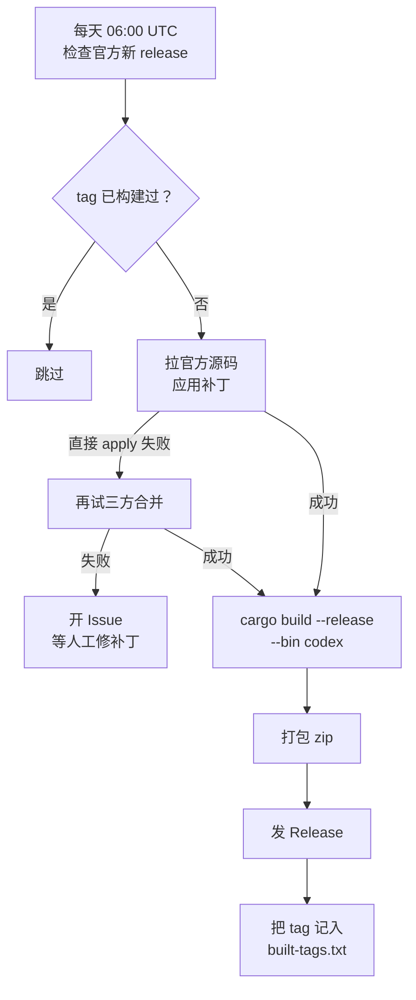

# codex-patched-build

自动把 `patches/codex-cli.patch` 应用到官方 codex 源码上，编译出打了补丁的
**Windows x64 版 `codex.exe`**，发到本仓库的 Release。

**本仓库不包含任何 codex 源代码。** 源码在 CI 里临时拉取。

## 用法

1. 打开 [Releases](../../releases)，下载最新的 `codex-<tag>-windows-x64.zip`
2. 解压，把 `codex.exe` 覆盖到 npm 包的 vendor 目录：

```
<nodejs>\node_modules\@openai\codex\node_modules\@openai\codex-win32-x64\
  vendor\x86_64-pc-windows-msvc\bin\codex.exe
```

例如本机路径是：

```
D:\Workspace\nvm\nodejs\node_modules\@openai\codex\node_modules\
  @openai\codex-win32-x64\vendor\x86_64-pc-windows-msvc\bin\codex.exe
```

3. 验证：

```bash
codex --version
```

覆盖前建议备份原文件（原文件约 323 MB）。

## 工作流程



## 补丁基线

| 项 | 值 |
|---|---|
| 当前基线 | `rust-v0.156.1` |
| 补丁文件 | `patches/codex-cli.patch`（41 个文件） |
| 已构建 | 见 `built-tags.txt` |

补丁按**具体版本**写的。官方改了代码结构后补丁会打不上，这时 CI 会开 Issue
而不是发坏产物。修补丁的步骤：

```bash
git clone --depth 1 -b rust-v0.157.1 https://github.com/openai/codex.git
cd codex
git apply --3way ../patches/codex-cli.patch   # 看冲突
# 按新版代码结构重写补丁
```

改完后更新 workflow 里的 `PATCH_BASELINE`，并确认 `built-tags.txt` 里没有
目标 tag（否则会被跳过）。

## 补丁内容

| # | 改动 |
|---|---|
| 1 | 模型请求进度用数据包体积代替 token 估算 |
| 2 | 压缩横幅区分「本地压缩 / 远程压缩」 |
| 3 | 重试上限 1000 次 |
| 4 | 重试固定 10 秒，去掉指数退避 |
| 5 | `ServerOverloaded` 等改为可重试 |
| 6 | cyber 警告只弹 Warning，不强制中断会话 |
| 7 | `resume` 忽略 provider 过滤，只按文件夹过滤 |
| 8 | GPT-5.6 上下文改回 353k |
| 9 | 模型无输出时按 Esc 快速改提示词 |
| 10 | 日志等级改 INFO |

> 未包含原始 `codex.patch` 里的「砍掉 desktop / mcp server 支持」那组改动 ——
> 那部分针对的代码结构在 0.156 已重构，需要单独处理。

## 手动触发

Actions → `build-windows-codex` → Run workflow，可指定：

- `tag`：构建哪个官方 tag（留空 = 最新正式版）
- `force`：忽略已构建记录，强制重建

## 为什么只编 `codex`

`codex` CLI 不依赖 `codex-code-mode`，因此不触发 V8 产物下载。官方 release
workflow 还会编 `codex-code-mode-host` / `codex-app-server` / `bwrap`，那些
需要自建 runner 和 `openai/codex` 的预编译 V8，fork 里跑不了，本仓库也不需要。
